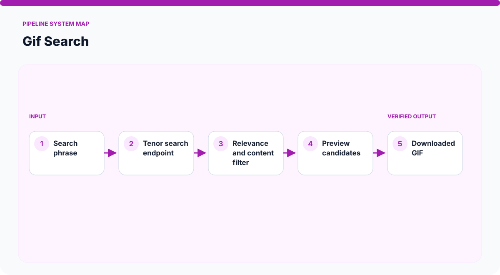
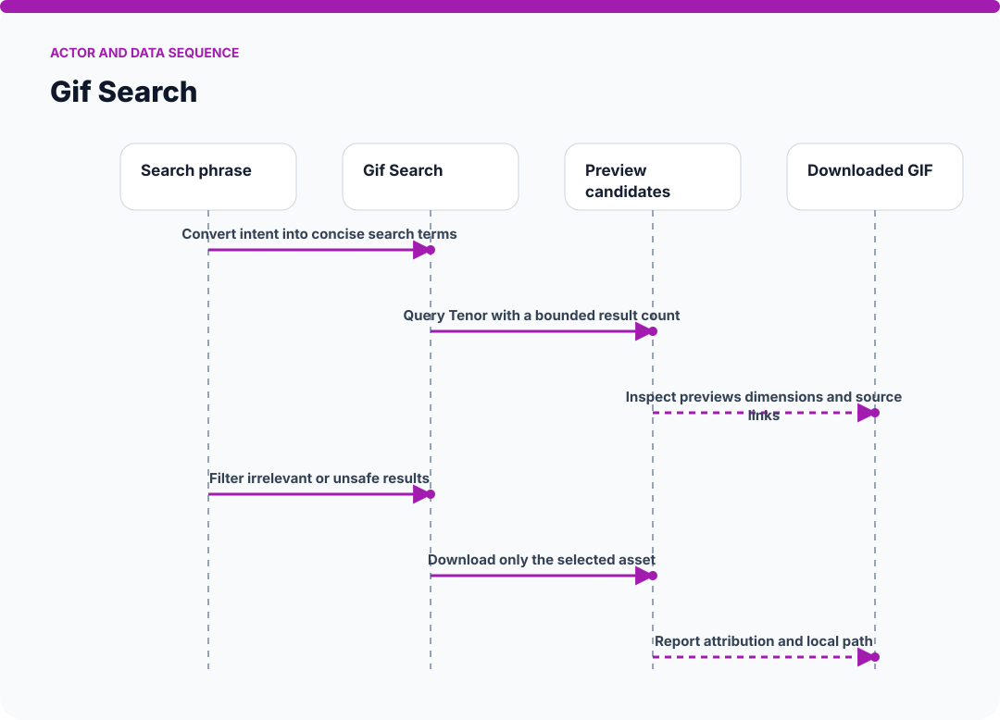
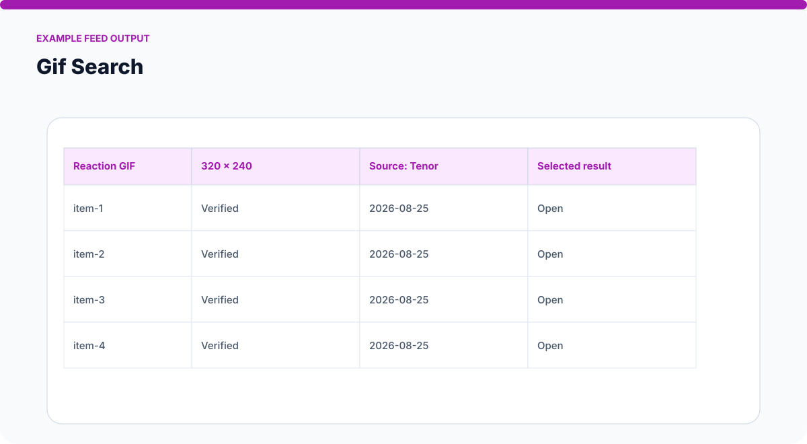
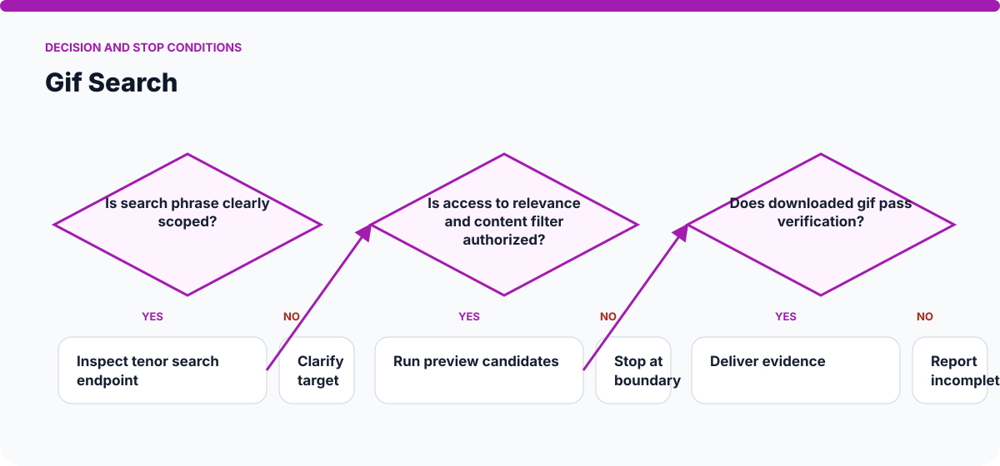

# How Gif Search Works

The visuals on this page are static SVGs, so they render directly on GitHub on phones and desktop browsers. Each one is generated from a model specific to this skill.

## System architecture

### Components

- **1. Search phrase:** participates in convert intent into concise search terms.
- **2. Tenor search endpoint:** participates in query tenor with a bounded result count.
- **3. Relevance and content filter:** participates in inspect previews dimensions and source links.
- **4. Preview candidates:** participates in filter irrelevant or unsafe results.
- **5. Downloaded GIF:** participates in download only the selected asset.

## Actor and data sequence

### 1. Convert intent into concise search terms

**Primary surface:** `Search phrase`

Record the concrete input, the operation performed, and the evidence produced at this stage. Continue only when the output is sufficient for the next stage; otherwise preserve the blocker and stop.
### 2. Query Tenor with a bounded result count

**Primary surface:** `Tenor search endpoint`

Record the concrete input, the operation performed, and the evidence produced at this stage. Continue only when the output is sufficient for the next stage; otherwise preserve the blocker and stop.
### 3. Inspect previews dimensions and source links

**Primary surface:** `Relevance and content filter`

Record the concrete input, the operation performed, and the evidence produced at this stage. Continue only when the output is sufficient for the next stage; otherwise preserve the blocker and stop.
### 4. Filter irrelevant or unsafe results

**Primary surface:** `Preview candidates`

Record the concrete input, the operation performed, and the evidence produced at this stage. Continue only when the output is sufficient for the next stage; otherwise preserve the blocker and stop.
### 5. Download only the selected asset

**Primary surface:** `Downloaded GIF`

Record the concrete input, the operation performed, and the evidence produced at this stage. Continue only when the output is sufficient for the next stage; otherwise preserve the blocker and stop.
### 6. Report attribution and local path

**Primary surface:** `Search phrase`

Record the concrete input, the operation performed, and the evidence produced at this stage. Continue only when the output is sufficient for the next stage; otherwise preserve the blocker and stop.

## Example output shape

The example is a visual contract: a real run may look different, but it should expose comparable state, provenance, and verification information. It is not presented as evidence of a live external action.

## Decision and stop conditions

The workflow stops when the target is ambiguous, the relevant surface is unavailable or unauthorized, or the final artifact cannot be checked. A logged-in session or successful tool call is not by itself proof that the requested outcome is complete.

## Verification checklist

- Confirm every component shown in the system map exists in the target environment.
- Trace the actor sequence using actual tool output or artifact state.
- Compare the result with the example-output information contract.
- Re-read or reopen the final artifact instead of trusting an attempt message.
- Report omitted stages, unsupported capabilities, and remaining human decisions.
